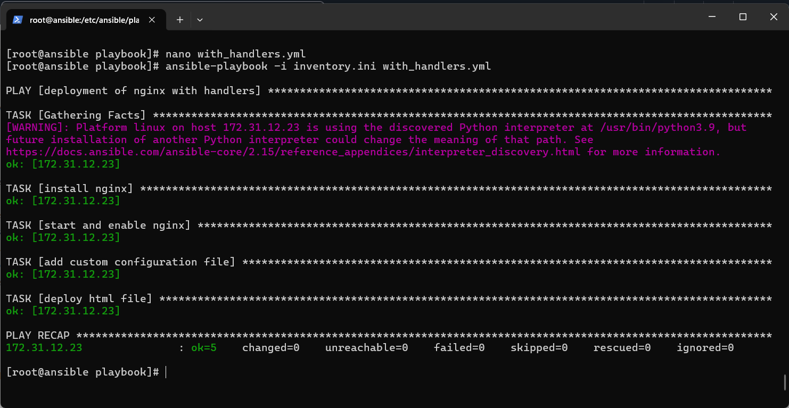
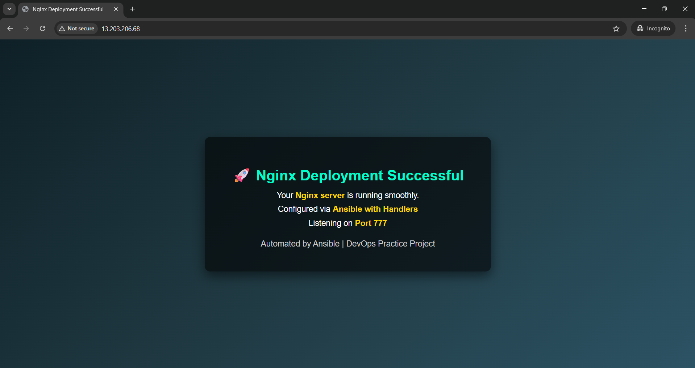
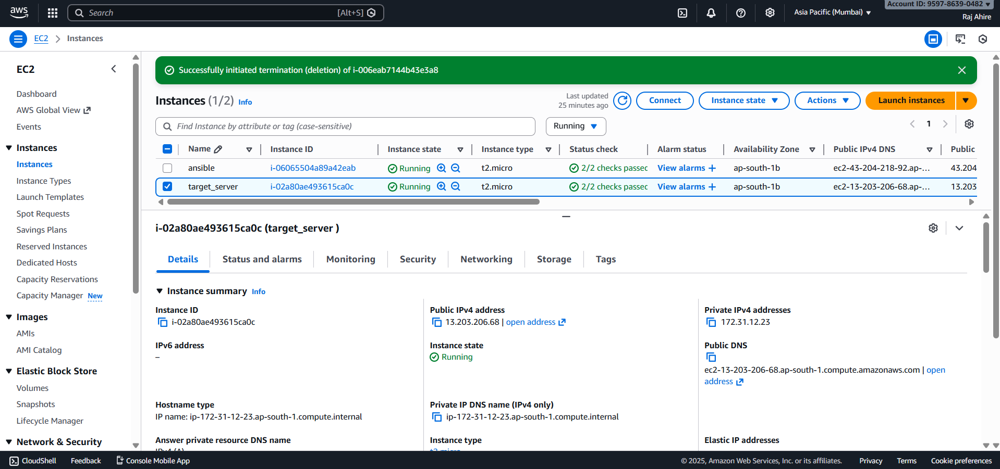

# Nginx Deployment Using Ansible Handlers on AWS EC2

## Project Overview

This project demonstrates **automated deployment and configuration of Nginx** on an **AWS EC2 target server** using **Ansible with Handlers**.

The automation installs Nginx, configures a **custom listening port (777)**, deploys a custom HTML page, and ensures the Nginx service is **reloaded automatically only when configuration changes occur**, following Ansible best practices.


## Architecture

The setup consists of two EC2 instances:

* **Ansible Control Node**

  * Executes Ansible playbooks
  * Manages target infrastructure via SSH

* **Target Server**

  * Runs Nginx
  * Hosts the deployed web application
  * Exposes port **777** publicly

---

## Technology Stack

* AWS EC2 (Amazon Linux)
* Ansible
* Nginx
* SSH
* Linux (RHEL-based)
* Infrastructure Automation

---

## Project Structure

```
ansible/
├── inventory.ini
├── with_handlers.yml
├── img/
│   ├── ansible_playbook_success.png
│   ├── nginx_deployment_successful.png
│   └── servers.png
```

---

## Ansible Playbook Highlights

### Key Features

* Package installation using `dnf`
* Service management using `systemd`
* Dynamic configuration management with `blockinfile`
* Automatic service reload using **handlers**
* HTML deployment using `copy`
* Fully idempotent execution

---

### Ansible Playbook (`with_handlers.yml`)

```yaml
# deployment of nginx with handlers
- name: deployment of nginx with handlers
  hosts: target_server
  become: yes

  vars:
    pkg: nginx
    svc: nginx
    file_path: /usr/share/nginx/html/index.html
    conf_file: /etc/nginx/conf.d/custom.conf
    src: /home/ec2-user/index.html

  tasks:
    - name: install nginx
      ansible.builtin.dnf:
        name: "{{ pkg }}"
        state: present

    - name: start and enable nginx
      ansible.builtin.systemd_service:
        name: "{{ svc }}"
        state: started
        enabled: true

    - name: add custom configuration file
      ansible.builtin.blockinfile:
        path: "{{ conf_file }}"
        create: yes
        block: |
          server {
              listen 777;

              location / {
                  root /usr/share/nginx/html;
                  index index.html index.htm;
              }
          }
      notify: restart nginx

    - name: deploy html file
      ansible.builtin.copy:
        src: "{{ src }}"
        dest: "{{ file_path }}"

  handlers:
    - name: restart nginx
      ansible.builtin.systemd_service:
        name: "{{ svc }}"
        state: reloaded
```

---

## Execution Command

```bash
ansible-playbook -i inventory.ini with_handlers.yml
```

---

## Playbook Execution Result

The playbook executes successfully with:

* No failed tasks
* No unreachable hosts
* No unnecessary service restarts
* Handler triggered only when configuration changes

### Ansible Playbook Output



---

## Nginx Deployment Verification

After successful execution, Nginx is accessible using the **public IP of the target server on port 777**.

```
http://<public-ip>:777
```

### Browser Verification



---

## AWS EC2 Infrastructure

The following screenshot shows the **Ansible control node** and **target server** running on AWS EC2.



---

## Why Ansible Handlers Are Important

Handlers ensure that services are restarted or reloaded **only when required**.

Benefits:

* Prevents unnecessary service interruptions
* Improves deployment efficiency
* Ensures predictable automation behavior
* Follows infrastructure-as-code best practices

In this project, the Nginx service is reloaded **only when the configuration file changes**.

---

## Real-World Use Case

This automation pattern is commonly used in:

* Production server configuration
* Zero-downtime deployments
* CI/CD pipelines
* Cloud infrastructure automation
* Standardized server provisioning

---

## Author & Links

* **LinkedIn:** [https://www.linkedin.com/in/raj-ahire](https://www.linkedin.com/in/raj-ahire)
* **Medium:** [https://medium.com/@rajahire326](https://medium.com/@rajahire326)


It reflects real DevOps practices such as idempotency, clean configuration management, and event-driven service control.
